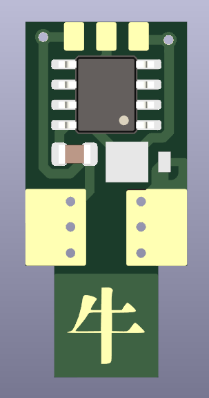
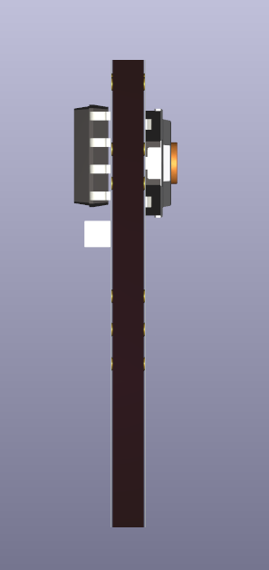
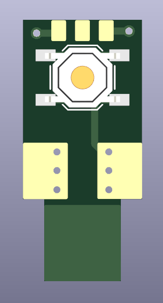
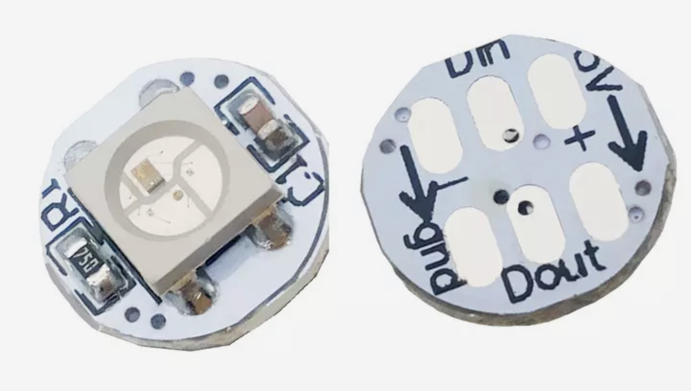

# 音游灯

<p float="left">
  
  
  
</p>
This is an RGB LED for use with Sanwa rhythm game buttons (also compaitible with many chinese clone buttons). Intended to be soldered to those cheap WS2812 circular PCBs readily available on Aliexpress which include on-board current limiting resistors and decoupling caps:



BOM:
```
1 ATTINY13A-SSU
1 100nF SMD cap 0805
1 schottky diode (MFG# UPS115UE3)
1 4x4x1.5mm tactile SMD tactile push button
1 WS2812 LED on PCB with res+cap
```
PCBs should be manufactured at 2.0mm thickness instead of standard 1.6mm. Soldering the WS2812 module on to the PCB can be a bit tricky, so I designed a jig which simplifies the alignment of the parts. The model is available in `jig/jig.stl`.

Special thanks to Tim (cpldcpu) for the <a href="https://github.com/cpldcpu/light_ws2812">implementation of
the WS2812 protocol</a>.

享受音游 享受生活
